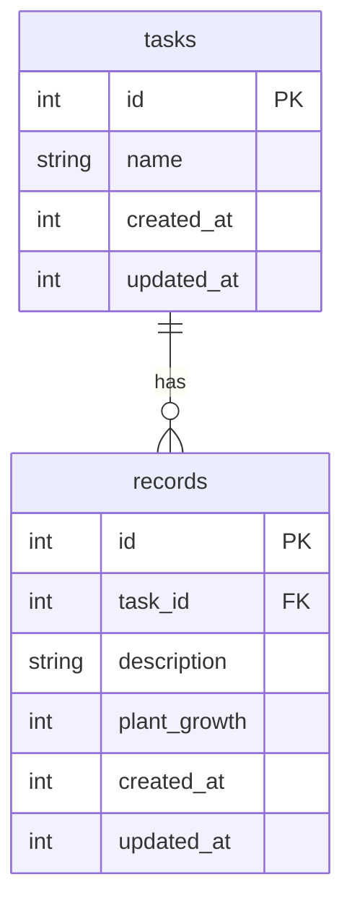

## フレームワーク

- **[Hono](https://hono.dev/)**
- **[better-sqlite3](https://github.com/WiseLibs/better-sqlite3)**
- **[Valibot](https://valibot.dev/)**

パッケージをインストール
```
npm install
```

サーバーを起動
```
npm run dev
```

## テーブル設計



